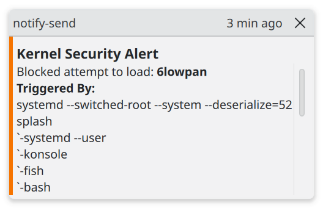

# modulejail-plus
Reduce the attack surface of Linux kernel modules by disabling unnecessary modules using [modulejail](https://github.com/jnuyens/modulejail), and provide desktop notifications for blocked modprobe attempts, along with which processes requested the module. No daemons, no initramfs changes, no AI inside the tool.

Additionally, this repo provides a guide to further reduce the unnecessary and potentially dangerous kernel modules that are **built into the kernel image**, which can't be disabled by modprobe blacklists (the technique used by modulejail).

This script `block-modules-and-notify.sh` also generates a txt file describing every module in the blacklist (using `modinfo`).

Here's a screenshot of the notification on KDE.


# Why

Linux kernel modules are vulnerable, with thousands of modules for rarely used, under-maintained, and potentially dangerous functionality (6000+ on my Ubuntu desktop). In 2026, we've seen severe kernel module vulnerabilities like **Copy Fail**, and **Dirty Frag**, which involve the `algif_aead`, `esp4`, `esp6`, `rxrpc` modules. 

As pointed out by [modulejail](https://github.com/jnuyens/modulejail), "AI-assisted security scanning is about to do to the Linux kernel what large-scale fuzzing did to userspace code a decade ago, only faster and at a much larger scale." 

For vulnerabilities in Linux kernel modules, **common security measures like SELinux are largely useless.**

This repo aims to make [modulejail](https://github.com/jnuyens/modulejail) easier to use by providing desktop notifications for blocked attempts to load modules (so that you can add those to the whitelist if some functionality breaks), and by giving a guide to disabling the modules built into the kernel image instead of being standalone ones (which aren't covered by `modulejail`).

# Quickstart

```
git clonehttps://github.com/neural-koala/modulejail-plus.git
cd modulejail-plus
sudo chmod +x block-modules-and-notify.sh
sudo ./block-modules-and-notify.sh
```
`block-modules-and-notify.sh` specifies the `desktop` profile for `modulejail`. You can change this to `conservative` or `minimal`.


## In Case the Blacklist Caused Issues
Although highly unlikely, you might want to know how to fix boot issues if the blacklist make your machine unable to boot. 

Add `modprobe.blacklist= ` (there is a space at the end) in grub to tell the kernel to ignore all blacklists.

## Using modprobed-db to Track Module Usage

Instead of manually whitelisting modules when occasionally used hardware (e.g., external hard drives) don't work, as prompted by the notification, you can use [modprobed-db](https://github.com/graysky2/modprobed-db) to track the usage of modules over a period of time, before applying the module blacklist.


# Disabling Modules Built into the Kernel Image

lsmod only shows loadable modules, but many modules are built into the kernel image, so they never appear in lsmod and ignore modprobe blacklists.

You can find the builtin modules of your machine by running

`cat /lib/modules/$(uname -r)/modules.builtin`

There are 306 such modules on the 7.0.0-15-generic kernel of my Ubuntu machine. Many such modules are obsolete, increasing your attack surface.

You might know that you can use `make localmodconfig` to reduce the amount of active kernel modules, by letting the program trim down the configuration that your machine is currently using. However, it still can't handle the built-in modules well due to some limitations. Therefore, **trimming down the built-in modules is largely a manual process**.

## A list of built-in modules you can safely disable
I can't find a list of obsolete built-in modules from the Internet, so I've manually compiled a list of built-in modules that you can safely disable based on the `modules.builtin` file of my Ubuntu 26.04 machine, if you are running a modern desktop/laptop/server, and do not need ancient things like CDROM (this list is not generated by AI). I appreciate any suggestions to adding other modules to the list.
```
kernel/drivers/acpi/acpi_dbg.ko
kernel/drivers/ata/ata_generic.ko
kernel/drivers/ata/ata_piix.ko
kernel/drivers/ata/pata_sis.ko
kernel/drivers/cdrom/cdrom.ko
kernel/drivers/char/agp/amd64-agp.ko
kernel/drivers/char/agp/intel-agp.ko
kernel/drivers/char/agp/via-agp.ko
kernel/drivers/video/fbdev/asiliantfb.ko
kernel/drivers/video/fbdev/imsttfb.ko
kernel/drivers/gpio/gpio-palmas.ko
kernel/drivers/mfd/palmas.ko
kernel/drivers/mfd/da9063.ko
kernel/drivers/mfd/max14577.ko
kernel/drivers/mfd/max77693.ko
kernel/drivers/mfd/tps65912-core.ko
kernel/drivers/mfd/tps65912-i2c.ko
kernel/drivers/mfd/tps65912-spi.ko
kernel/drivers/input/mousedev.ko
kernel/drivers/net/slip/slhc.ko
kernel/drivers/rapidio/rapidio.ko
kernel/kernel/trace/rv/wwnr.ko
kernel/drivers/char/agp/agpgart.ko
kernel/drivers/usb/host/ohci-hcd.ko
kernel/drivers/usb/host/uhci-hcd.ko
kernel/net/802/fddi.ko
kernel/drivers/pinctrl/intel/pinctrl-cherryview.ko
kernel/drivers/scsi/sr_mod.ko
kernel/drivers/cpufreq/powernow-k8.ko
kernel/drivers/cpufreq/speedstep-centrino.ko
```

## Building a custom kernel
Then, you can run `python3 ./block-builtin-modules/map_blacklist_to_kconfig_entries.py` to print the kernel .config entries corresponding to items in the blacklist.

Finally, due to the complexity of kernel configurations, use `make menuconfig` to search for each item printed by the previous step, and set them accordingly, and you can compile a minimal custom linux kernel. 

# Other Ways to Harden your Machine 
Here are some other ideas for hardening your machine:
- limit the capabilities of root with techniques like SELinux, setcap, seccomp, kernel lockdown mode.
- use intrusion detection and anomaly detection.
- adopt the zero-trust paradigm.
- disable Dynamic Module Loading entirely (not recommended for desktop computers).


# FAQ
**If my machine does not have hardware corresponding to built-in modules such as amd64-agp and cdrom, am I still susceptible to vulnerabilities in them?**

Yes, Even if hardware is absent, a vulnerable driver may still expose:

- ioctl handlers,
- sysfs/procfs interfaces,
- netlink interfaces,
- filesystem parsers,
- and so on.

If a regular, unprivileged user (or a hacker who has gained access to a low-level service like a web server) triggers a system call that requires a specific network protocol or socket type, the kernel will attempts to be helpful. It calls modprobe to automatically load the module into memory on the fly, even if the underlying physical hardware doesn't exist. 